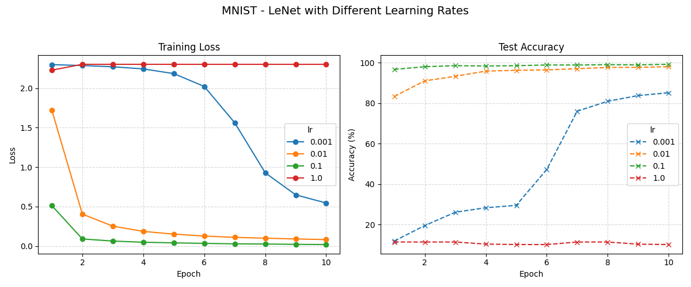
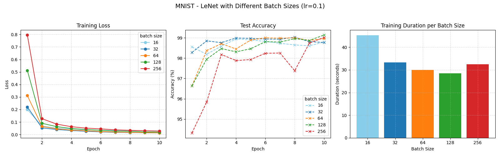
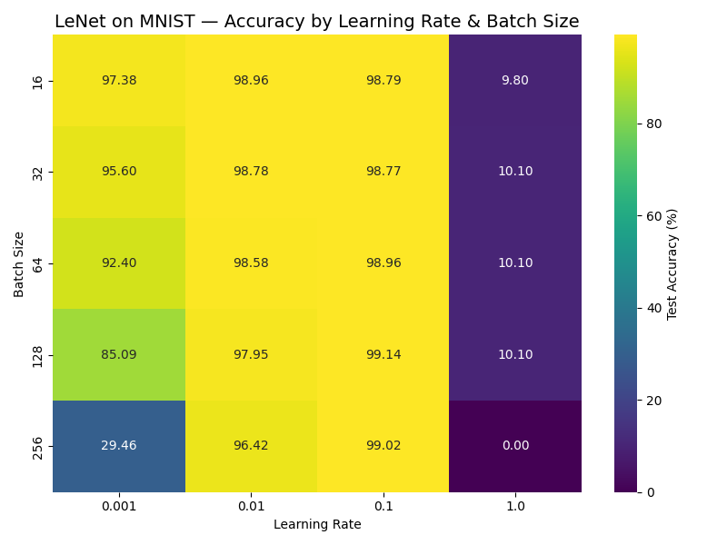

## MNIST Classification with LeNet 

Code to expriement with LeNet CNN on MNIST. You will need `libtorch`. To build the proejct just run 

```bash 
cmake -S . -B build 
cmake --build build 
```

Then run the code from within the build directory as such 

```bash 
./cnn --lr 0.1 --b 64 --e 10 
```
- `--lr` is the learning rate 
- `--b` is the batch size 
- `--e` is the number of epochs 

The hyperparamters used along with the metric (loss and accuracy) will be saved in json file in a directory named `results` and the model weights in directory called `models` located up one directory from where the code is excuted. 

```bash 
Model saved to: "../models/LeNet_lr0.01_b32_e5_.pt"
Results saved to: "../results/LeNet_lr0.01_b32_e5_.json"
```



